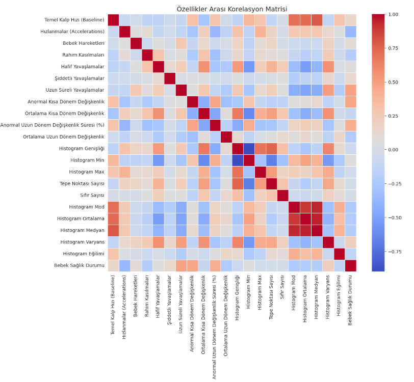
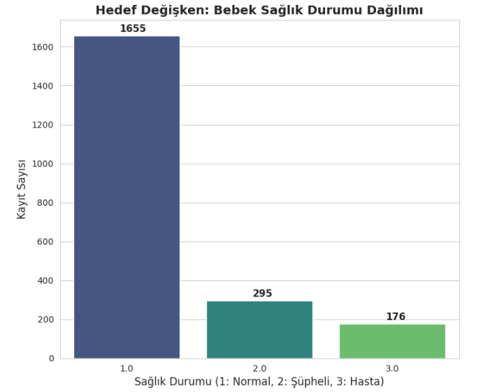
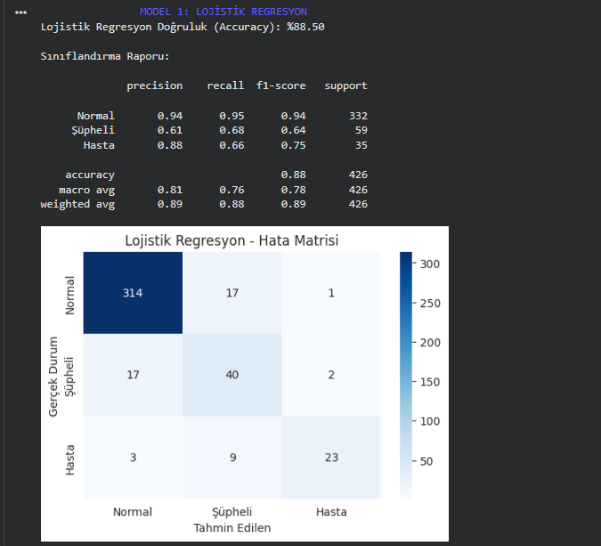
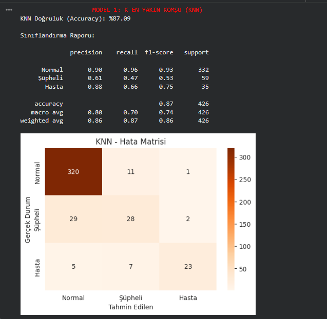
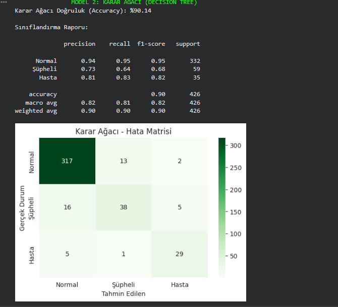

# [👶 Fetal Health Classification (Cenin Sağlığı Sınıflandırması)](https://github.com/fizmr/fetal_health_classification/blob/main/fetal_heal_csv.ipynb)

[🇺🇸 English](#english) | [🇹🇷 Türkçe](#türkçe)

---

## 🇺🇸 Project Overview
This project aims to classify the health status of a fetus based on Cardiotocograms (CTGs) data using Machine Learning algorithms.

### 📊 Exploratory Data Analysis (EDA)
Before training the models, I analyzed the dataset to understand correlations and class distributions.

**1. Correlation Heatmap:**
*(Shows how features relate to each other and the target variable)*

**2. Target Class Distribution:**
*(Shows the imbalance between Normal, Suspect, and Pathological classes)*

### 🧠 Models & Performance
I trained three different models. Here are the results:

#### 1. Logistic Regression
* **Accuracy:** %88.50
* A strong baseline model for this dataset.
* 

#### 2. K-Nearest Neighbors (KNN)
* **Accuracy:** %87.09
* Below is the performance visualization for KNN:
* 

#### 3. Decision Tree (Best Model 🏆)
* **Accuracy:** **%90.14**
* The Decision Tree performed the best by capturing non-linear relationships.
  

---

## 🇹🇷 Proje Özeti
Bu proje, Kardiyotokografi (CTG) verilerini kullanarak anne karnındaki bebeğin sağlık durumunu makine öğrenmesi algoritmalarıyla tahmin etmeyi amaçlar.

### 📊 Keşifçi Veri Analizi (EDA)
Modelleri eğitmeden önce veri setindeki ilişkileri ve dağılımları inceledim.

**1. Korelasyon Haritası (Heatmap):**
*(Özelliklerin birbirleriyle ve hedef değişkenle ilişkisini gösterir)*

**2. Sınıf Dağılım Grafiği:**
*(Normal, Şüpheli ve Patolojik sınıflar arasındaki dengesizliği gösterir)*

### 🧠 Modeller ve Performans
Üç farklı model eğitildi. Sonuçlar şu şekildedir:

#### 1. Lojistik Regresyon
* **Doğruluk:** %88.50
* Veri seti için güçlü bir temel (baseline) oluşturdu.

#### 2. K-En Yakın Komşu (KNN)
* **Doğruluk:** %87.09
* KNN modeline ait performans grafiği aşağıdadır:

#### 3. Karar Ağacı (En İyi Model 🏆)
* **Doğruluk:** **%90.14**
* Karmaşık ilişkileri yakalayarak en yüksek başarıyı bu model gösterdi.

---

### 🔗 Connect with Me

*(Click the badge above to visit my profile)*
